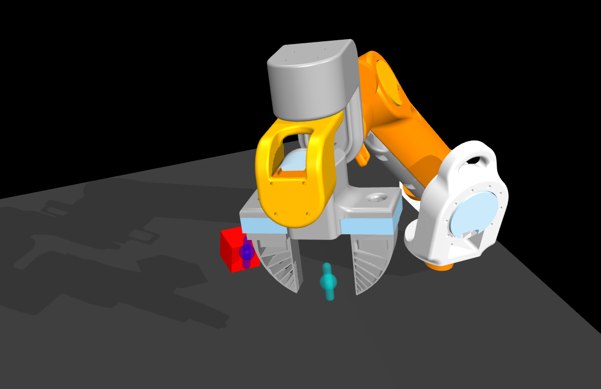
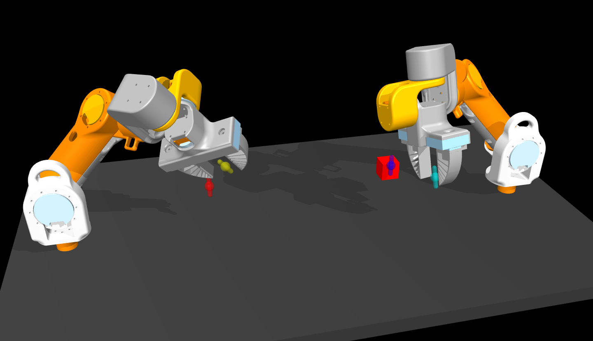
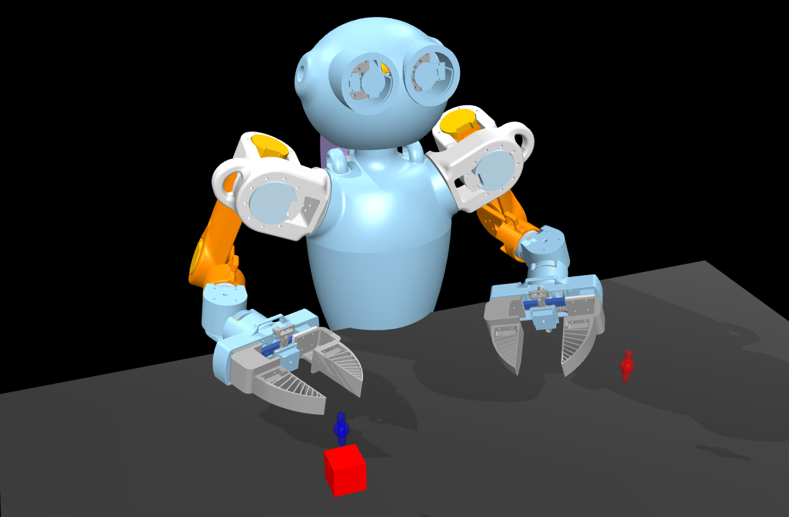

<p align="center">
  <picture>
    
  </picture>
</p>

<div align="center">

[](https://github.com/kscalelabs/gym-ksuite/main/LICENSE)
[](https://discord.gg/k5mSvCkYQh)
[](https://humanoids.wiki)
<br />
[](https://github.com/pre-commit/pre-commit)
[](https://github.com/kscalelabs/sim/actions/workflows/update_stompy_s3.yml)

</div>
<h1 align="center">
    <p>K-Scale Manipulation Suite</p>
</h1>

## Gymnasium+MuJoCo Environments

<table>
  <tr>
    <td></td>
    <td></td>
    <td></td>
  </tr>
  <tr>
    <td align="center"><b>KManipSoloArm</b> environment has one 7dof arm with a 1dof gripper. <b>KManipSoloArmVision</b> has a gripper cam, a head cam, and an overhead cam.</td>
    <td align="center"><b>KManipDualArm</b> environment has two 7dof arms with 1dof grippers. <b>KManipDualArmVision</b> has 2 gripper cams, a head cam, and an overhead cam.</td>
    <td align="center"><b>KManipTorso</b> environment has a 2dof head, two 6dof arms with 1dof grippers. <b>KManipTorsoVision</b> has 2 gripper cams, a head cam, and an overhead cam.</td>
  </tr>
</table>


## Installation

clone and install dependencies

```bash
git clone https://github.com/hu-po/gym-kmanip.git && cd gym-kmanip
conda create -y -n gym-kmanip python=3.10 && conda activate gym-kmanip
pip install -e .
```

run tests

```bash
pip install pytest
pytest tests/test_env.py
```

## Usage - Basic

visualize the mujoco scene

```bash
python gym_kmanip/examples/1_view_env.py
```

record a video of the mujoco scene

```bash
python gym_kmanip/examples/2_record_video.py
```

## Usage - Recording Data

🤗 [K-Scale HuggingFace Datasets](https://huggingface.co/kscalelabs)

data is recorded via teleop, this requires additional dependencies

```bash
pip install opencv-python==4.9.0.80
pip install vuer==0.0.30
pip install rerun-sdk==0.15.1
```

start the server on the robot computer

```bash
python gym_kmanip/examples/3_record_data.py
```

start ngrok on the robot computer.

```bash
ngrok http 8012
```

open the browser app on the vr headset and go to the ngrok url

## Help Wanted

✅ solo arm w/ vision

✅ dual arm w/ vision

⬜️ torso w/ vision

✅ inverse kinematics using mujoco

⬜️ tune and improve ik

⬜️ recording dataset via teleop

⬜️ training policy from dataset

⬜️ evaluating policy on robot

## Dependencies

- [Gymnasium](https://gymnasium.farama.org/) is used for environment
- [MuJoCo](http://www.mujoco.org/) is used for physics simulation
- [PyTouch](https://pytorch.org/) is used for model training
- [Rerun](https://github.com/rerun-io/rerun/) is used for logging datasets
- [HuggingFace](https://huggingface.co/) is used for dataset & model storage 
- [Vuer](https://github.com/vuer-ai/vuer) *teleop only* is used for visualization
- [ngrok](https://ngrok.com/download) *teleop only* is used for networking

helpful links and repos

- [dm_control](https://github.com/google-deepmind/dm_control)
- [gym-pybullet-drones](https://github.com/utiasDSL/gym-pybullet-drones)
- [gym-aloha](https://github.com/huggingface/gym-aloha)
- [lerobot](https://github.com/huggingface/lerobot)
- [universal_manipulation_interface](https://github.com/real-stanford/universal_manipulation_interface)

### Citation

```
@misc{teleop-2024,
  title={gym-kmanip},
  author={Hugo Ponte},
  year={2024},
  url={https://github.com/kscalelabs/gym-kmanip}
}
```